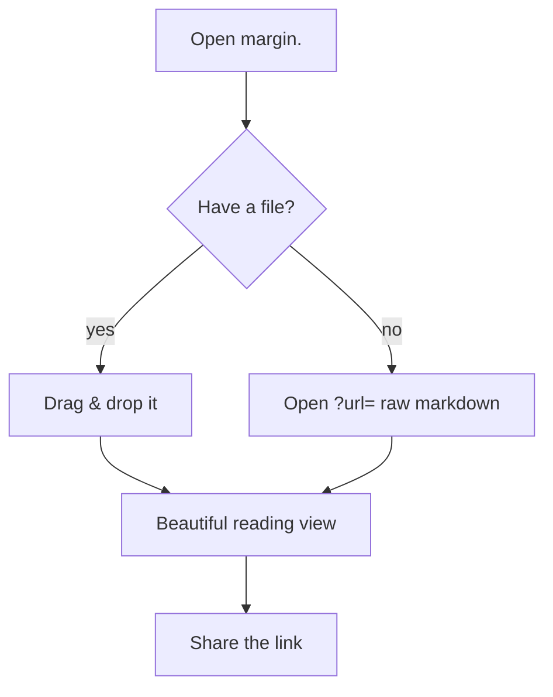
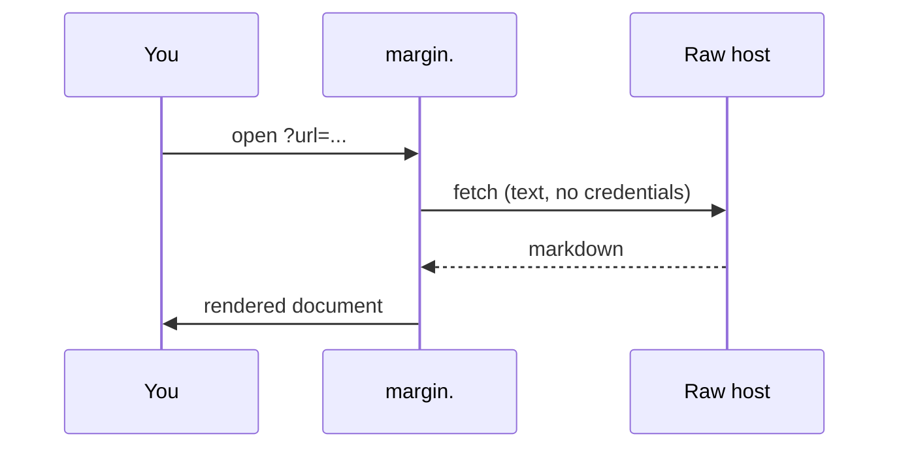

# margin.

> Markdown, read beautifully. This is a demo document — drag in your own `.md` file, or open one with `?url=`, and it renders here.

A lightweight, client-side viewer. **Nothing in this document ever leaves your device.** It supports GitHub-Flavoured Markdown, syntax-highlighted code, Mermaid diagrams, a generated table of contents, and a calm light/dark theme.

## Typography & flow

The reading column is set to a comfortable measure (~65 characters) with a serif body face and generous vertical rhythm, so long-form text feels closer to a well-set book than a raw `README`. Inline code like `useState` reads cleanly, and links open in a new tab safely.

### Lists

- First, **upload** a Markdown file (drag & drop or pick one).
- Second, share a document by URL — see [Sharing](#sharing) below.
- Third, navigate with the table of contents on the left (or the sheet on mobile).

Task lists work too:

- [x] Render headings, lists, tables, blockquotes
- [x] Highlight code with Shiki
- [ ] Add PDF export (a future consideration)

### A table

| Feature            | Status | Notes                          |
| ------------------ | :----: | ------------------------------ |
| GFM                |   ✅   | tables, task lists, autolinks  |
| Syntax highlighting |   ✅   | Shiki, dual theme              |
| Mermaid            |   ✅   | responsive, error-isolated     |
| URL loading        |   ✅   | client-side, CORS permitting   |

## Code

A fenced block with a language gets highlighted. The theme follows your light/dark choice.

```ts
// A tiny React hook that tracks an element's visibility.
import { useEffect, useState } from 'react'

export function useInView(ref: React.RefObject<HTMLElement | null>) {
  const [seen, setSeen] = useState(false)
  useEffect(() => {
    const el = ref.current
    if (!el || seen) return
    const io = new IntersectionObserver(([entry]) => {
      if (entry.isIntersecting) {
        setSeen(true)
        io.disconnect()
      }
    })
    io.observe(el)
    return () => io.disconnect()
  }, [ref, seen])
  return seen
}
```

```bash
# install & run locally
npm install
npm run dev
```

```python
def fib(n: int) -> int:
    a, b = 0, 1
    for _ in range(n):
        a, b = b, a + b
    return a
```

## Diagrams

Mermaid blocks render to crisp, responsive SVG. If one fails, the rest of the document still renders.





## Blockquotes & emphasis

> "Simplicity is the ultimate sophistication." Strikethrough like ~~this~~ and **strong** or *italic* text are supported.

---

## Sharing

Append `?url=` pointing at a raw Markdown file to share a document directly:

```
https://USER.github.io/margin/?url=https://raw.githubusercontent.com/OWNER/REPO/HEAD/README.md
```

Works best with hosts that send permissive CORS headers — `raw.githubusercontent.com`, `gist.githubusercontent.com`, and `cdn.jsdelivr.net`. Some hosts (GitLab, Codeberg, Bitbucket raw) block browser fetches; margin. will tell you when that happens.

## That's it

Open a new file any time from the top bar. Happy reading.
